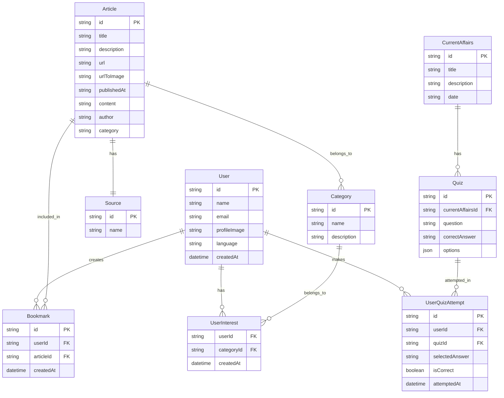

# News App

A modern Flutter news application built with GetX state management and MVC architecture.

## Features

- Real-time news updates
- Current affairs section
- Interactive quiz system
- User profile management
- Custom date-based news search
- Voice search functionality
- News sharing capabilities
- Rating system
- Dark/Light theme support
- Offline storage support

## Technology Stack

### Framework
- Flutter SDK >=3.1.0
- GetX for state management
- MVC (Model-View-Controller) architecture

### Key Dependencies
- `get`: State management and routing
- `get_storage`: Local storage management
- `cached_network_image`: Efficient image loading and caching
- `http`: API communication
- `google_nav_bar`: Modern bottom navigation
- `flutter_rating_bar`: Rating functionality
- `speech_to_text`: Voice search feature
- `shimmer`: Loading animations
- `shared_preferences`: Local data persistence
- `image_picker`: Image selection functionality
- `permission_handler`: Device permissions management

## Project Structure
```
lib/
  ├── model/         # Data models
  ├── view/          # UI screens
  ├── controller/    # Business logic
  ├── utils/         # Helper functions
  └── services/      # API services
```

## Database Structure


## Getting Started

1. Clone the repository
2. Install dependencies:
   ```bash
   flutter pub get
   ```
3. Configure your API keys (check `.env.example` for required keys)
4. Run the app:
   ```bash
   flutter run
   ```

## Security Note
API keys and sensitive credentials should be stored in a secure environment file. Never commit sensitive credentials to version control.

## Design
- Material Design principles
- Modern UI/UX with smooth animations
- Responsive layout for various screen sizes
- Custom themes support

## Performance Features
- Efficient image caching
- Lazy loading
- Offline support
- Optimized state management

## Contributing
Feel free to submit issues and enhancement requests.
